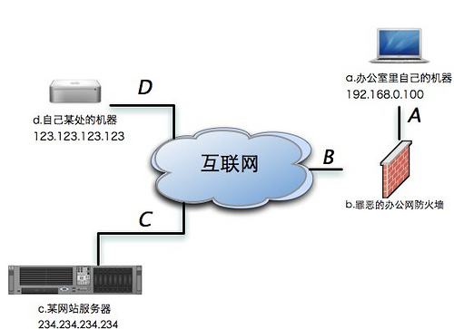

****************
命令使用总结
****************

.. _mount-iso:

挂载ISO到光盘
-------------
        
    - **mount** 挂载命令  
    - **umount** 卸载命令
    - **-o loop** 指定选项,挂载 :term:`Loop device`  。默认是只读  
        
    ::
        
        sudo mount -t iso9660 -o loop /home/matt/precise-desktop-i386.iso /cdrom
        sudo umount /cdrom

    * 挂载时添加读写参数        

    ::

        sudo mount -t iso9660 -o loop,rw /home/matt/precise-desktop-i386.iso /cdrom

添加光盘源
-----------------------

    ::

        sudo apt-cdrom -d /cdrom -m -o=Dir::Media::MountPath=/cdrom add
 
    
压缩文件处理
-----------------

    * 解压bz2、gz、tgz。（bz2比gz **更小** ） 

        ::

            tar xvzf file.tar.gz
            tar jvzf file.tar.bz2
            tar xvzf file.tgz

    * 解压 rar
        
        ::

            unrar x file.rar /tmp

    * 使用7z

        ::

            7z x file.tar -o/tmp

查询软件包包含的文件
--------------------

    ::
    
        dpkg -L pkgname

启动更新管理器
--------------

    ::

        update-manager

    **在线升级版本**
    ::

        update-manger -d

检索历史命令(显示行号)
-----------------------

    1. cat 
        
        ::

            cat -b ~/.bash_history | grep ls
            !123

    #. history
        
        ::

            history | grep ls 

    #. alias
        
        ::

            alias searchistory="history | grep "

按日期备份
--------------

    ::

        tar cPizvf backup-`date +%Y%M%d-%S`.tar.gz /var/cache/apt/archives --exclude=/var/cache/apt/archivesapartial/* --exclude=/var/cache/apt/archives/lock
        

下载源码包
-----------

    对某个软件的源码感兴趣，可以直接下载相关的源码。

    ::

        apt-get source wmctrl
        

    如果不能自动解压，则需要安装dpkg-dev

    ::

        sudo aptitude install dpkg-dev

Terminal下查看图片
-------------------

    就是用那个 *图像查看器* 。它对应的命令叫做 ``eog``

    ::
        
        eog 1.jpg

在终端下使用默认程序打开文件
-----------------------------

    大部分能搞定，但是pdf文件好像只能打开程序。
    
    ::

        xdg-open unixs.gif

文件的三种时间
---------------

* 访问
* 更改
* 改动（权限）

    查看

        ::
        
            stat file

    列出（ls）

        改动(change)

        ::
        
            ls -lc

        访问(use)

        ::
        
            ls -lu
            
        更改

        ::
            
            ls -l

    查找（find）

        按天数(三天之前)

        ::

            find . -atime +3
            find . -mtime +3
            find . -ctime +3

        按分钟(三分钟以内)

        ::

            find . -amin -3
            find . -mmin -3
            find . -cmin -3

        
.. index::
   single: ssh; ssh tunnel

SSH隧道
---------

-N      告诉SSH客户端，这个连接不需要执行任何命令。仅仅做端口转发 
-f      告诉SSH客户端在后台运行
-L XYZ  将本地机(客户机)的某个端口转发到远端指定机器的指定端口
-R XYZ  将远程主机(服务器)的某个端口转发到本地端指定机器的指定端口

* ssh本地隧道
    
    将IP为Y的机器的Z端口通过中间服务器映射到本地机器的X端口。 

    ::
    
        ssh -N -f -L 2121:234.234.234.234:21 123.123.123.123

    现在访问本地2121端口，就能连接234.234.234.234的21端口了

    ::

        ftp localhost:2121 

* ssh远程隧道

    把内部的Y机器的Z端口映射到远程机器的X端口上

    ::
    
        ssh -N -f -R 2222:127.0.0.1:22 123.123.123.123

    在IP是123.123.123.123的机器上我们用下面的命令就可以登陆公司的IP是192.168.0.100的机器了。

    ::

        ssh -p 2222 localhost

SSH 翻墙
--------

-p  指定远程主机的端口. 可以在配置文件中对每个主机单独设定这个参数.
-D  指定一个本地机器 “动态的” 应用程序端口转发. 工作原理是这样的,
    本地机器上分配了一个 socket 侦听 port 端口, 一旦这个端口上有了连接,
    该连接就经过安全通道转发出去,
    根据应用程序的协议可以判断出远程主机将和哪里连接. 目前支持 SOCKS4 协议,
    ssh 将充当 SOCKS4 服务器. 只有 root 才能转发特权端口.
    可以在配置文件中指定动态端口的转发.
-T  禁止分配伪终端
-q  安静模式, 消除所有的警告和诊断信息.

常用翻墙命令

::

    ssh -p 9999 -qTfnN -D 7070 onlybird@ssh.unssh.com
